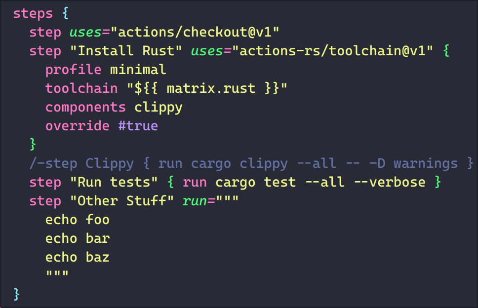

# KDL for Visual Studio Code

This extension provides editing and syntax highlighting support for
[KDL](https://kdl.dev), a document language with xml-like semantics that looks
like you're invoking a bunch of CLI commands!

## Features

* Syntax highlighting
* Brace matching
* Auto-indentation

## Known Issues

See [our GitHub repository](https://github.com/kdl-org/vscode-kdl) for active
issues.

## Release Notes

### 2.0.0

Updates syntax to match KDL 2.0.0. A separate KDL extension has been published
with legacy v1 support.

### 1.1.0

Updates syntax to match KDL 1.0.0, including supporting type annotations.

### 1.0.0

Initial release of KDL syntax highlighting.
